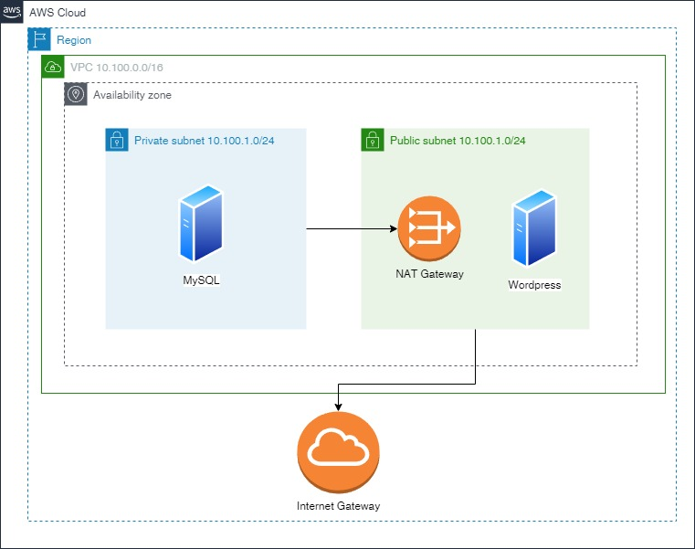

# Terraform-MySQL-Wordpress

The objective is to create Terraform configuration files that will create:

- VPC.
- 2 Subnets: one private and one public.
- Internet Gateway.
- NAT Gateway.
- Route Tables.
- Route Tables Associations.
- EC2 instance running Wordpress container on the public subnet.
- EC2 instance running MySQL container on the private subnet.



To deploy the environment, run the following commands:

```sh
# Export AWS credentials
export AWS_ACCESS_KEY_ID=<your-access-key>
export AWS_SECRET_ACCESS_KEY=<your-secret-key>

# Apply the Terraform configuration files
terraform init
terraform apply
```

To destroy the environment, run the following command:

```sh
terraform destroy
```

Get ssh private key:

```sh
scp -i sshKey.pem sshKey.pem ubuntu@PUBLIC_IP(instance1):~/
chmod 400 sshKey.pem
ssh -i sshKey.pem ubuntu@Private_IP(instance2)
```

Connect to the public instance:

```sh
ssh -i sshKey.pem ubuntu@Public_IP(instance1)
```

Connect to the private instance - use the public instance as a jump server:

```sh
# send ssh key to the public instance
scp -i sshKey.pem sshKey.pem ubuntu@PUBLIC_IP(instance1):~/

# ssh to the public instance
ssh -i sshKey.pem ubuntu@Public_IP(instance1)

# ssh to the private instance
chmod 400 sshKey.pem
ssh -i sshKey.pem ubuntu@Private_IP(instance2)
```
